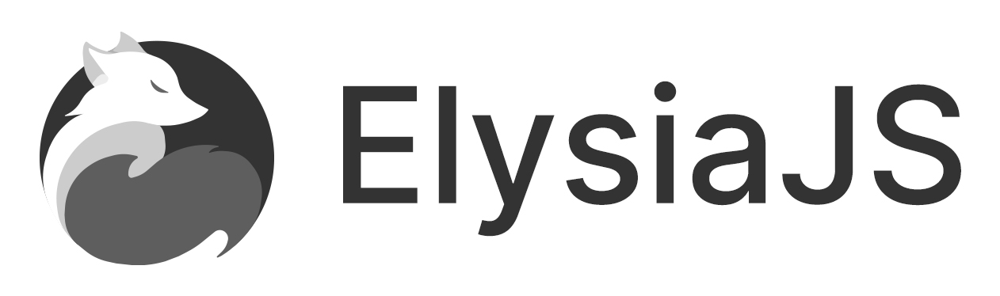

# About This Project
This project will serve as my mini-project for the public, where I welcome anyone interested in contributing. I'm open to collaboration, and my goal with this project is to create a boilerplate that enables developers to quickly build fast, robust, and efficient APIs using ElysiaJS and Bun.

## Getting Started
To get started with this template, simply paste this command into your terminal:
```bash
bun create elysia ./elysia-example
```

## Development
To start the development server run:
```bash
bun run dev
```

Open http://localhost:3000/ with your browser to see the result.

## RestAPI IDE
for RestAPI IDE, `Insomnia` which is more simplify and low in memory usage. You can import it into your `insomnia` apps i placed my exported file in the folder `collections`.

## Structure Folder
| Name | Description |
| --- | --- |
| `controller` | Placed for logic our business which will handle transaction from prisma client |
| `model` | Object validation request |
| `prisma/schema` | Information about table in our database and connection |
| `prisma/migrations` | Migrations which will be generated |
| `routes` | Our routing information |
| `utils` | Custom configurations for utilization |
| `src` | Main or core `elysiajs` |


## Steps
* Prisma and Handle Basic GET, POST methods (`01_BASIC_Elysia.js`)

